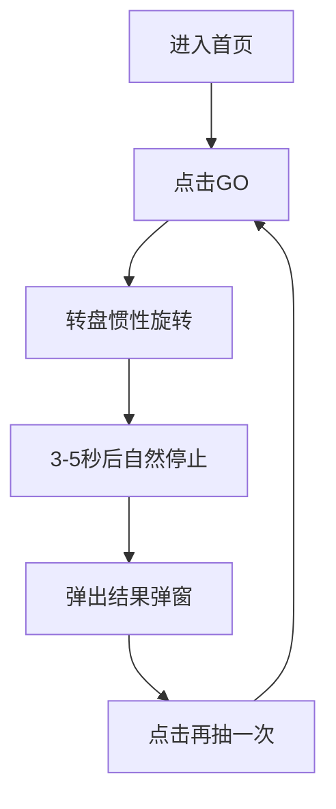

## 1. 产品概述
一款完全离线、单页可用的“明信片抽卡”转盘，用于路演现场互动。观众点击“GO”后，转盘惯性旋转3-5秒并随机揭晓一张明信片文案，营造惊喜与公平。

## 2. 核心功能

### 2.1 用户角色
| 角色 | 获取方式 | 权限 |
|----|--------|------|
| 现场观众 | 打开网页即可 | 抽奖、查看结果、刷新可重复体验 |

### 2.2 功能模块
本应用仅包含**一个页面**：
1. **抽奖页**：转盘、GO按钮、吉他拨片指针、设置入口、结果弹窗。

### 2.3 页面细节
| 页面 | 模块 | 功能描述 |
|------|------|----------|
| 抽奖页 | 转盘区域 | 8格圆形转盘，每格显示一张明信片标题；点击GO后惯性旋转3-5秒随机停止，指针所指即为抽中结果。 |
| 抽奖页 | GO按钮 | 唯一交互按钮；点击后禁用自身直至转盘完全停止，防止重复触发。 |
| 抽奖页 | 吉他拨片指针 | 倒置黑色（或白色）高对比拨片形状，固定在顶部中央，尖端指向转盘格。 |
| 抽奖页 | 设置按钮 | 右上角齿轮图标，点击打开设置弹窗。 |
| 抽奖页 | 结果弹窗 | 停止后自动弹出，展示抽中的明信片完整文案与配图；提供“再抽一次”关闭弹窗。 |
| 抽奖页 | 设置弹窗 | 可编辑5张明信片标题与文案；提供“保存到本地”与“重置为默认”两个按钮；所有数据仅写入浏览器LocalStorage，无网络请求。 |

## 3. 核心流程

## 4. 用户界面设计

### 4.1 设计基调
- 主色：#FFD748（温暖黄）
- 辅色：#FFFFFF（卡片背景）、#333333（文字）、#FF4F4F（强调红）
- 按钮：圆角矩形+阴影，悬停微放大
- 字体：思源黑体，标题36 px，正文16 px
- 图标：线性风格，2 px描边
- 转盘：白底+8等分彩色扇形，文字居中

### 4.2 模块样式速览
| 模块 | 关键UI元素 |
|------|------------|
| 转盘 | 直径320 px，白底，8彩色扇形，标题14 px白色加粗，居中。 |
| GO按钮 | 底部中央，88*88 px圆形，主色填充，白色“GO”18 px加粗，点击瞬间缩小0.95。 |
| 指针 | 倒置吉他拨片，黑色高对比，顶部固定，尖端距转盘外边缘8 px。 |
| 设置弹窗 | 卡片式圆角12 px，遮罩50 %透明黑；内部表单分两栏：标题输入、文案文本域；底部双按钮。 |
| 结果弹窗 | 居中卡片，图片占60 %宽度，标题24 px，正文16 px，底部“再抽一次”按钮。 |

### 4.3 适配策略
桌面优先：默认按414×896 px（iPhone 11）设计，通过CSS媒体查询在平板与桌面居中显示，最大宽度480 px。