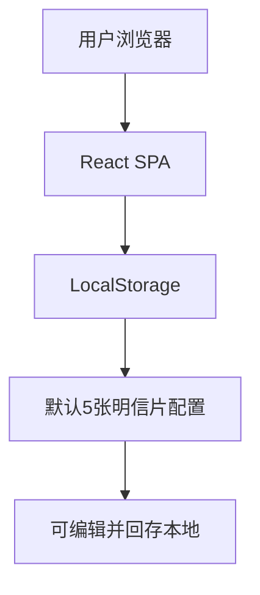

## 1. 架构设计


## 2. 技术描述
- 前端：React@18 + Vite + TailwindCSS@3
- 初始化工具：vite-init
- 后端：无（纯静态SPA）
- 数据存储：浏览器LocalStorage（key: `postcard-config`）

## 3. 路由定义
| 路由 | 作用 |
|------|------|
| / | 唯一页面，包含转盘、设置、结果弹窗等所有功能 |

## 4. 组件结构
```
src/
├── components/
│   ├── Wheel.jsx          // 转盘+指针+GO按钮
│   ├── ResultModal.jsx    // 结果弹窗
│   └── SettingsModal.jsx  // 设置弹窗（含重置默认）
├── hooks/
│   └── useLocalStorage.js // LocalStorage读写
├── data/
│   └── defaultCards.js    // 默认5张明信片数据
└── App.jsx                // 单页入口
```

## 5. 核心交互逻辑
1. 首次加载：若LocalStorage无数据，写入默认5张明信片。
2. 点击GO：
   - 禁用按钮；
   - 生成随机角度（>1800°，模拟3-5秒惯性）；
   - CSS transform旋转，监听transitionend；
   - 停止后计算指针所指索引，弹出结果。
3. 设置：
   - 读取当前配置到表单；
   - 保存：写回LocalStorage；
   - 重置：覆盖为defaultCards并立即保存。

## 6. 性能与离线
- 全站资源<200 KB，可提前缓存（Service Worker可选）。
- 零网络请求，路演现场无网也能用。
- 转盘使用CSS transform+will-change，60 fps流畅动画。