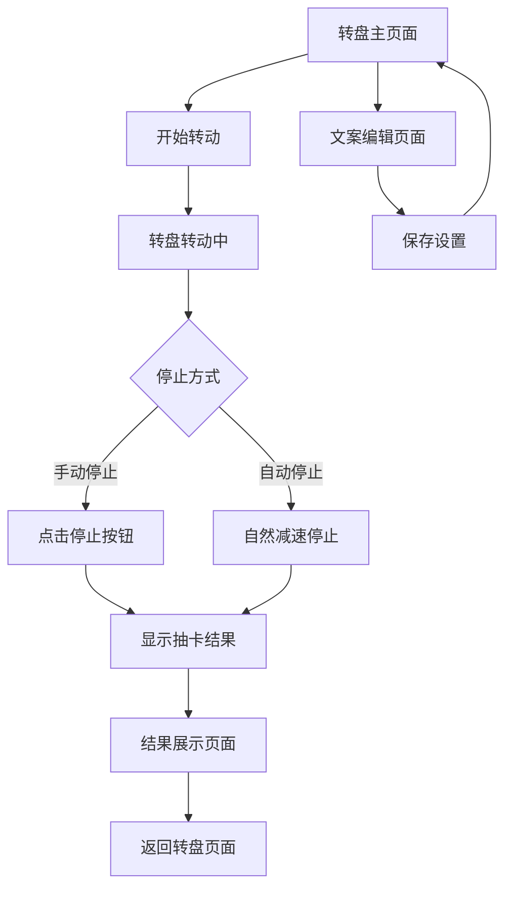

## 1. Product Overview
圣诞大转盘是一个线下吉他路演互动小程序，通过转盘形式让观众抽取5种不同内容的明信片礼物。项目旨在增强路演现场的互动性和趣味性，让观众通过随机抽取的方式获得精美的明信片纪念品。

目标用户为参加线下音乐路演的观众，通过多巴胺色彩搭配和青春张扬的设计风格，营造轻松愉快的互动氛围。

## 2. Core Features

### 2.1 User Roles
| Role | Registration Method | Core Permissions |
|------|---------------------|------------------|
| 路演主持人 | 本地访问 | 编辑转盘分区文案、开始/停止转盘、重置游戏 |
| 观众参与者 | 无需注册 | 观看转盘转动、获得抽卡结果 |

### 2.2 Feature Module
圣诞大转盘MVP包含以下核心页面：
1. **转盘主页面**：转盘展示、转动控制、结果展示区域
2. **文案编辑页面**：5种明信片文案的编辑和预览
3. **结果展示页面**：抽卡结果详情和明信片预览

### 2.3 Page Details
| Page Name | Module Name | Feature description |
|-----------|-------------|---------------------|
| 转盘主页面 | 转盘展示区域 | 显示5等分转盘，每分区显示对应明信片标题，支持平滑转动动画效果 |
| 转盘主页面 | 转动控制按钮 | 提供"开始转动"和"停止"按钮，控制转盘启停，按钮有明显视觉反馈 |
| 转盘主页面 | 结果展示弹窗 | 转盘停止后弹出中奖结果，显示获得的明信片类型和预览图 |
| 文案编辑页面 | 文案编辑表单 | 提供5个文本输入框，分别编辑5种明信片标题和描述文案 |
| 文案编辑页面 | 实时预览功能 | 编辑时实时显示转盘分区内容变化，支持保存和重置功能 |
| 结果展示页面 | 明信片详情展示 | 全屏展示获得的明信片，包含背景图案、文案内容和获得时间 |
| 结果展示页面 | 分享功能按钮 | 提供截图保存按钮，方便观众保存或分享获得的明信片 |

## 3. Core Process

### 主持人操作流程：
1. 进入文案编辑页面，设置5种明信片的内容
2. 保存设置后返回转盘主页面
3. 邀请观众参与抽卡互动
4. 点击"开始转动"按钮启动转盘
5. 在适当时机点击"停止"按钮
6. 向观众展示抽卡结果

### 观众参与流程：
1. 观看主持人操作转盘转动
2. 等待转盘自然停止或主持人手动停止
3. 查看弹出的抽卡结果
4. 获得对应的明信片奖励

## 4. User Interface Design

### 4.1 Design Style
- **主色调**：多巴胺色系组合（亮粉色#FF6B9D、活力橙#FFA726、柠檬黄#FFEB3B、薄荷绿#4CAF50、天空蓝#2196F3）
- **按钮样式**：3D立体效果，圆角设计，悬停时有缩放动画
- **字体选择**：无衬线现代字体，主标题使用加粗大字号（32px+），正文使用常规字号（16px）
- **布局风格**：居中对称布局，转盘占据页面主要空间，控制按钮位于底部
- **图标风格**：使用圆润的emoji风格图标，增加亲和力和趣味性

### 4.2 Page Design Overview
| Page Name | Module Name | UI Elements |
|-----------|-------------|-------------|
| 转盘主页面 | 转盘展示区域 | 直径占屏幕宽度80%的圆形转盘，5个等分扇形区域，每个区域使用不同的多巴胺色彩，文字居中显示，添加阴影效果增强立体感 |
| 转盘主页面 | 控制按钮区域 | 两个大型圆形按钮（开始/停止），采用渐变色彩设计，按钮文字使用白色，添加脉冲动画吸引注意力 |
| 文案编辑页面 | 编辑表单区域 | 5组输入框垂直排列，每组包含标题和描述两个输入框，使用卡片式布局，背景为半透明白色，边框使用对应转盘区域的颜色 |
| 结果展示页面 | 明信片展示区 | 全屏模态框展示，明信片采用3D倾斜效果，背景添加光晕效果，文案使用优雅的字体排版，底部显示获得时间戳 |

### 4.3 Responsiveness
- 采用桌面端优先设计，主要面向线下路演场景的大屏幕展示
- 支持平板设备自适应，确保在10英寸以上屏幕有良好的显示效果
- 移动端支持基础功能，但主要优化方向为桌面和平板体验

### 4.4 后期音效扩展规划
- 转盘转动音效：持续循环的轻快音乐，随转动速度变化音调
- 按键音效：清脆的点击声，不同按钮有不同音调区分
- 中奖音效：欢快的提示音，根据获得的明信片类型播放不同音效
- 背景氛围音乐：轻柔的吉他伴奏，营造温馨的路演氛围