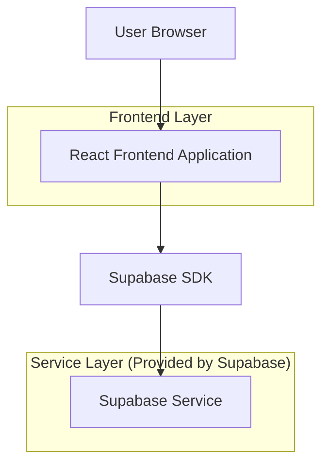
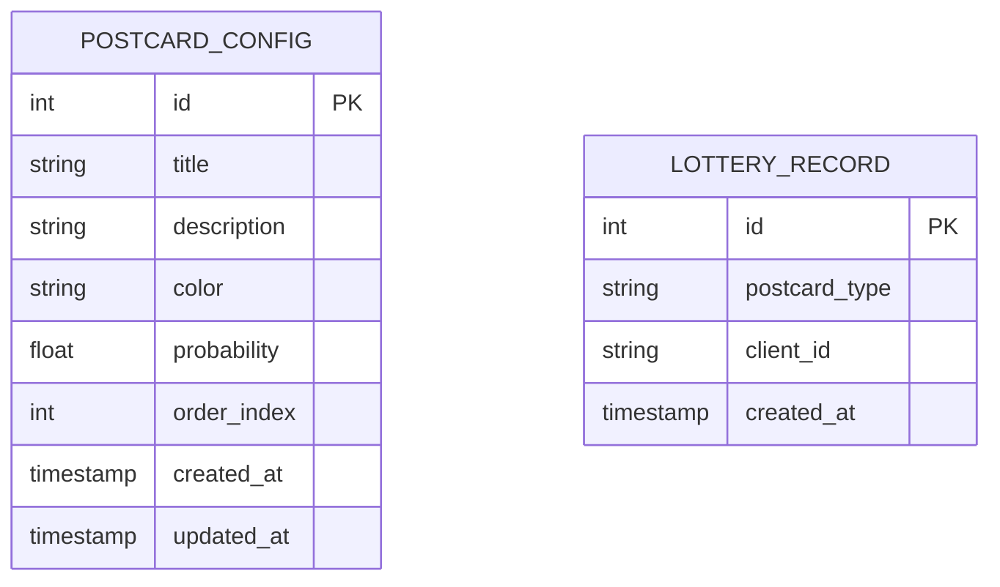

## 1.Architecture design



## 2.Technology Description
- Frontend: React@18 + tailwindcss@3 + vite
- Initialization Tool: vite-init
- Backend: Supabase (for数据存储)
- 动画库: framer-motion (转盘转动动画)
- 状态管理: React Context API

## 3.Route definitions
| Route | Purpose |
|-------|---------|
| / | 转盘主页面，显示转盘和主要交互功能 |
| /edit | 文案编辑页面，编辑5种明信片的内容 |
| /result | 结果展示页面，显示抽卡获得的明信片详情 |

## 4.API definitions

### 4.1 Core API

明信片配置相关
```
GET /api/postcard-configs
```

Response:
| Param Name| Param Type  | Description |
|-----------|-------------|-------------|
| configs   | array       | 5种明信片的配置信息 |

Example
```json
{
  "configs": [
    {
      "id": 1,
      "title": "音乐梦想",
      "description": "愿音乐点亮你的每一个梦想",
      "color": "#FF6B9D",
      "probability": 0.2
    }
  ]
}
```

更新明信片配置
```
PUT /api/postcard-configs
```

Request:
| Param Name| Param Type  | isRequired  | Description |
|-----------|-------------|-------------|-------------|
| configs   | array       | true        | 更新后的配置数组 |

## 5.Server architecture diagram
由于使用Supabase BaaS服务，无需自建服务器架构。前端直接通过Supabase SDK与数据库交互。

## 6.Data model

### 6.1 Data model definition


### 6.2 Data Definition Language

明信片配置表 (postcard_configs)
```sql
-- create table
CREATE TABLE postcard_configs (
    id SERIAL PRIMARY KEY,
    title VARCHAR(100) NOT NULL,
    description TEXT NOT NULL,
    color VARCHAR(7) NOT NULL CHECK (color ~ '^#[A-F0-9]{6}$'),
    probability DECIMAL(3,2) NOT NULL CHECK (probability > 0 AND probability <= 1),
    order_index INTEGER NOT NULL CHECK (order_index >= 1 AND order_index <= 5),
    created_at TIMESTAMP WITH TIME ZONE DEFAULT NOW(),
    updated_at TIMESTAMP WITH TIME ZONE DEFAULT NOW()
);

-- create index
CREATE INDEX idx_postcard_configs_order ON postcard_configs(order_index);
CREATE INDEX idx_postcard_configs_probability ON postcard_configs(probability);

-- init data
INSERT INTO postcard_configs (title, description, color, probability, order_index) VALUES
('音乐梦想', '愿音乐点亮你的每一个梦想', '#FF6B9D', 0.20, 1),
('青春回忆', '记录最美好的青春时光', '#FFA726', 0.20, 2),
('温暖祝福', '送上最温暖的节日祝福', '#FFEB3B', 0.20, 3),
('勇气力量', '给你继续前进的勇气', '#4CAF50', 0.20, 4),
('希望未来', '拥抱充满希望的未来', '#2196F3', 0.20, 5);
```

抽奖记录表 (lottery_records)
```sql
-- create table
CREATE TABLE lottery_records (
    id SERIAL PRIMARY KEY,
    postcard_type VARCHAR(100) NOT NULL,
    client_id VARCHAR(255) NOT NULL,
    created_at TIMESTAMP WITH TIME ZONE DEFAULT NOW()
);

-- create index
CREATE INDEX idx_lottery_records_client_id ON lottery_records(client_id);
CREATE INDEX idx_lottery_records_created_at ON lottery_records(created_at DESC);
```

### 6.3 Supabase权限配置
```sql
-- 匿名用户权限（观众查看）
GRANT SELECT ON postcard_configs TO anon;
GRANT SELECT ON lottery_records TO anon;

-- 认证用户权限（主持人编辑）
GRANT ALL PRIVILEGES ON postcard_configs TO authenticated;
GRANT ALL PRIVILEGES ON lottery_records TO authenticated;

-- RLS策略（行级安全）
ALTER TABLE postcard_configs ENABLE ROW LEVEL SECURITY;
ALTER TABLE lottery_records ENABLE ROW LEVEL SECURITY;

-- 创建策略
CREATE POLICY "任何人都可以查看明信片配置" ON postcard_configs
    FOR SELECT USING (true);

CREATE POLICY "认证用户可以修改明信片配置" ON postcard_configs
    FOR ALL USING (auth.role() = 'authenticated');

CREATE POLICY "任何人都可以查看抽奖记录" ON lottery_records
    FOR SELECT USING (true);

CREATE POLICY "认证用户可以创建抽奖记录" ON lottery_records
    FOR INSERT WITH CHECK (auth.role() = 'authenticated');
```

## 7.前端技术实现要点

### 7.1 转盘转动算法
- 使用CSS transform和transition实现平滑转动
- 采用贝塞尔曲线缓动函数模拟真实转盘物理效果
- 根据概率权重计算最终停止位置

### 7.2 响应式设计
- 使用Tailwind CSS的响应式类名
- 转盘大小根据屏幕尺寸动态调整
- 移动端优化触摸交互体验

### 7.3 状态管理
- 使用React Context管理全局状态
- 本地存储保存明信片配置
- 实时同步到Supabase数据库